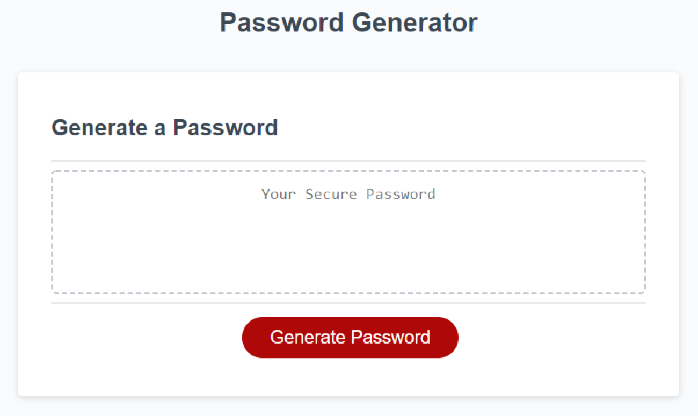

# Password Generator

## Overview

An application that an employee can use to generate a random password in the browser.

The web app features dynamically updated HTML and CSS powered by JavaScript code.

The password can include special characters.

Application deployed at https://stevelab1.github.io/password-generator/

## Appearance and functionality

The following image shows the web application's appearance and functionality:

